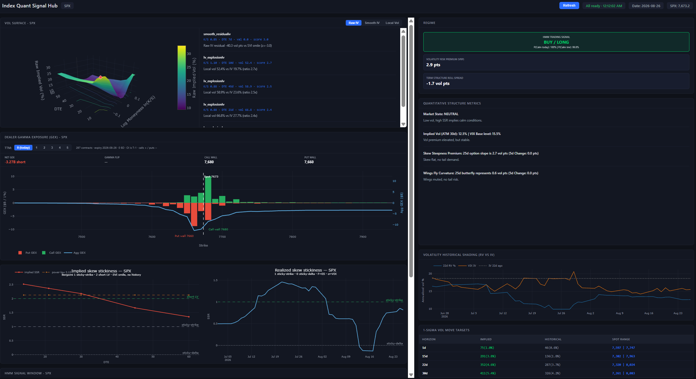
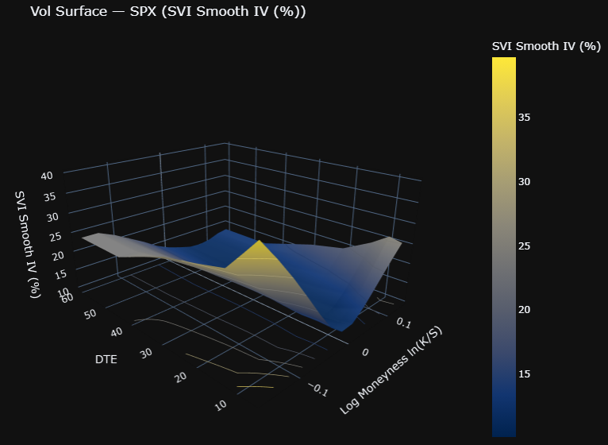
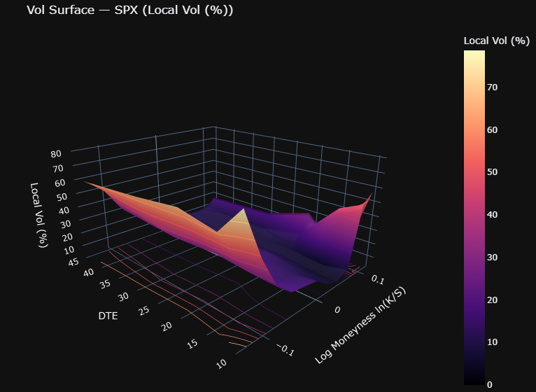
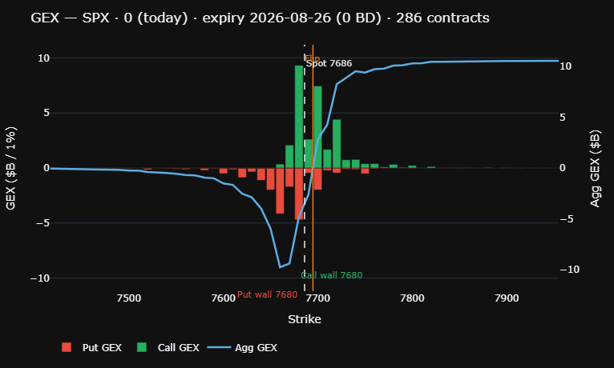
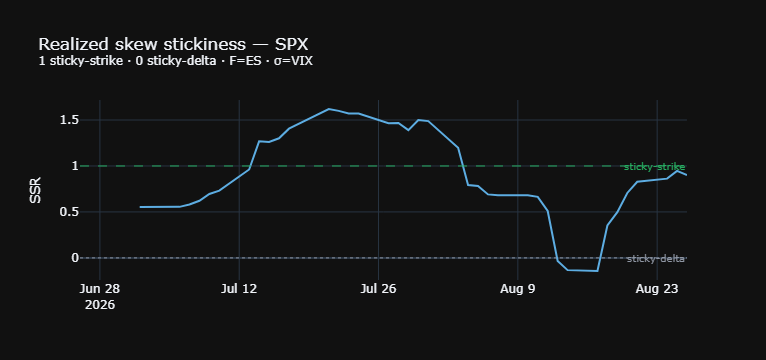
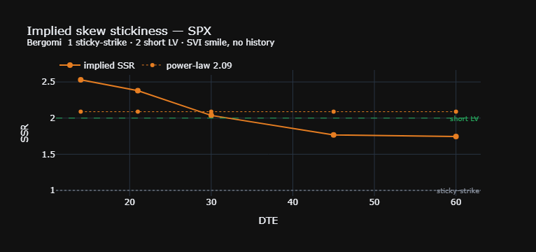
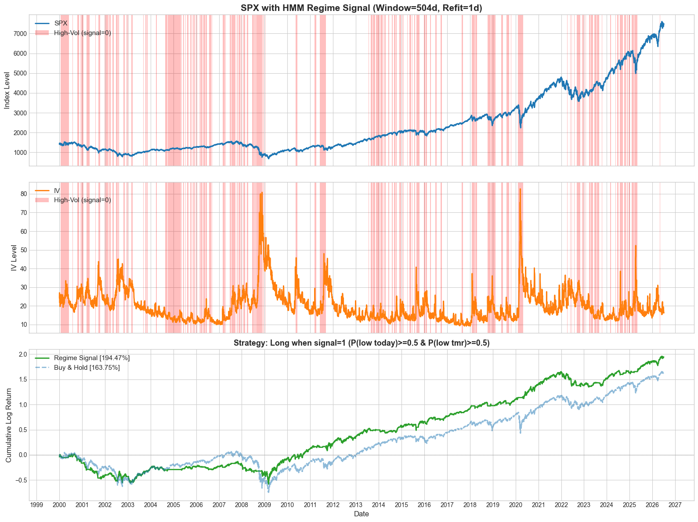
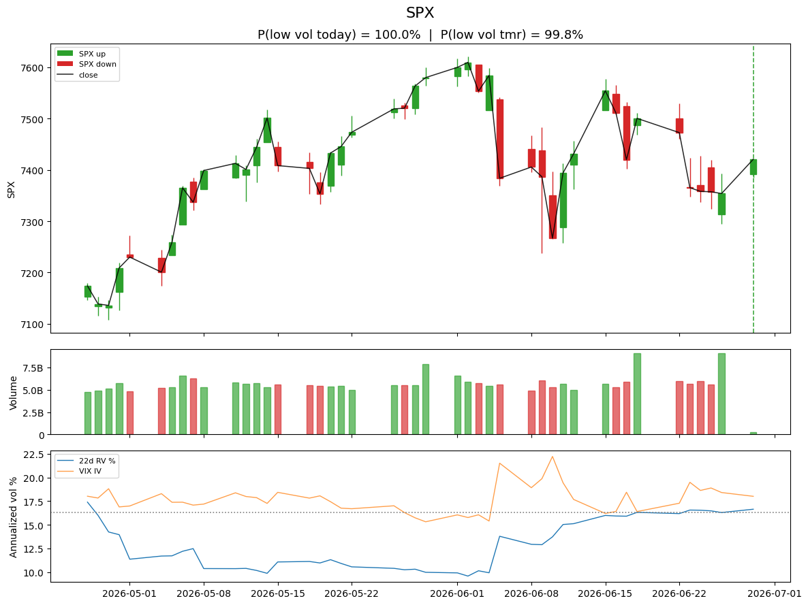
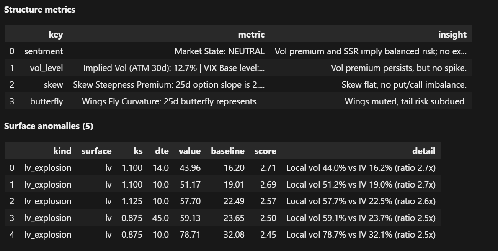

# Signal Monitor

Signal Monitor is an SPX options-and-volatility dashboard for monitoring surface structure, dealer positioning, and regime risk in one place.  
It combines SVI and Dupire modeling, GEX analytics, realized/implied skew stickiness diagnostics, a 2-state HMM regime filter, and an optional LLM interpretation layer.

## 1) Full Dashboard First

The live dashboard in `app.py` brings together:
- 3D volatility views (raw IV, SVI-smoothed IV, Dupire local vol)
- Dealer GEX profile by short-dated TTM buckets
- Realized and implied skew stickiness ratio (SSR)
- HMM low-vol/high-vol regime probabilities and trade filter
- LLM-generated interpretation layer for structure metrics



## 2) Volatility Surface (SVI + Dupire)

The volatility module builds an implied-vol grid on moneyness and tenor, smooths it with SVI, and then maps it to local volatility with Dupire.

SVI (total variance) parameterization:

$$
w(k)=a+b\left[\rho(k-m)+\sqrt{(k-m)^2+\sigma^2}\right]
$$

Dupire local volatility (risk-neutral):

$$
\sigma_{\text{loc}}^2(K,T)=
\frac{\partial_T C(K,T)+rK\,\partial_K C(K,T)}
{\tfrac{1}{2}K^2\,\partial_{KK}C(K,T)}
$$

This is useful because SVI stabilizes sparse option quotes into a smooth smile, while Dupire translates the surface into state-dependent instantaneous volatility for risk and scenario work.




## 3) GEX (Gamma Exposure)

Dealer gamma exposure is computed by strike and aggregated into short-dated business-day buckets:

$$
\mathrm{GEX}=\Gamma \times \mathrm{OI} \times M \times S^2 \times 0.01 \times \mathrm{sign}
$$

where calls use `+1` and puts use `-1`.  
This helps frame intraday flow risk: net positive GEX tends to dampen moves (dealers buy dips/sell rips), while net negative GEX can amplify price swings.



## 4) Realized & Implied SSR (Skew Stickiness Ratio)

Realized SSR is estimated with a rolling OLS setup:

$$
R=\frac{1}{S_T}\frac{d\sigma_{\text{ATMF}}}{d\ln F}
$$

with regression form:

$$
\Delta\sigma_t \approx R\cdot (S_T\,\Delta\ln F_t)
$$

Implied SSR follows a Bergomi-style term-structure relation:

$$
R_T=2+\frac{d\ln|S_T|}{d\ln T}
$$

SSR helps quantify smile dynamics under spot moves (sticky-delta vs sticky-strike), improving hedge assumptions and separating volatility repricing from directional spot stress.

Practical interpretation:
- **How IV moves when spot moves:** `SSR ≈ 1` is closer to sticky-strike, `SSR ≈ 0` is closer to sticky-delta, and `SSR > 1` often indicates a more aggressive smile response to spot shocks.
- **Whether repricing is normal or stressed:** rising SSR usually means downside moves are triggering stronger ATM IV repricing, while falling SSR suggests a softer vol response.
- **Hedging and positioning implications:** higher SSR often means delta/vega hedges can drift faster under spot moves; lower SSR usually implies more stable smile dynamics and less jumpy hedge behavior.




## 5) HMM Volatility Regime Filter

A 2-state Gaussian HMM classifies market conditions into low-vol and high-vol/choppy regimes using rolling estimation and probability-based signal filtering.

Core feature definitions:

$$
\mathrm{RV22}_t=\mathrm{Std}(\log r,22)\times\sqrt{252}\times100
$$

$$
\mathrm{laggedVRP}_t=IV_{t-22}-\mathrm{RV22}_t
$$

This filter helps reduce false risk-on signals during unstable periods and keeps directional exposure concentrated in statistically calmer states.




## 6) LLM Interpretation Layer

The dashboard can route structure metrics (surface shape, VRP context, GEX regime, SSR, and HMM probabilities) to an LLM summarizer for a concise narrative readout.

This speeds up discretionary review while keeping the quantitative signals as the primary source of truth.



## Quick Run

```bash
pip install numpy pandas scipy yfinance hmmlearn scikit-learn plotly futu-api
python app.py
```

Open `http://127.0.0.1:8050`.
