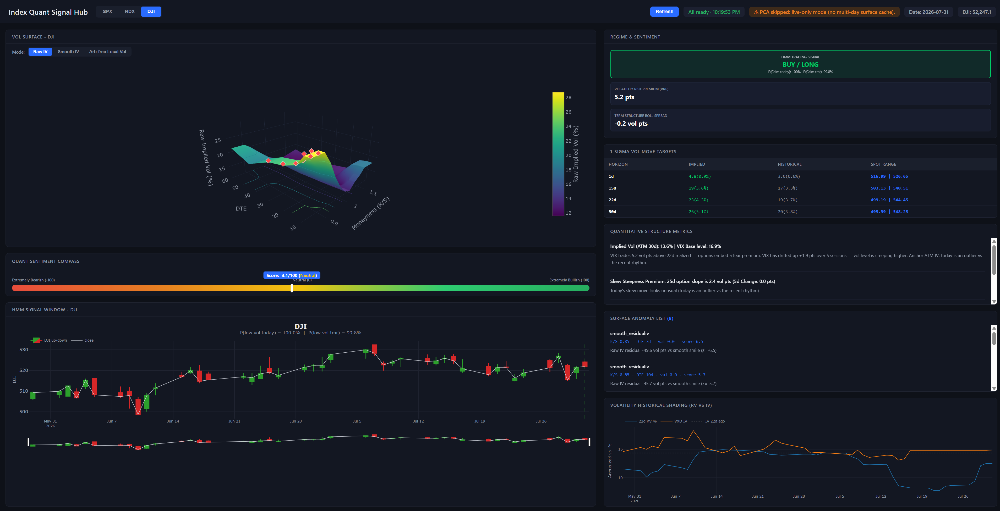

# Signal Monitor

A compact options-and-volatility analytics dashboard focused on SPX.  
It combines surface modeling (SVI + Dupire), dealer positioning (GEX), skew stickiness diagnostics (SSR), and an HMM volatility-regime filter, with optional LLM interpretation for daily context.

## 1) Full Dashboard First

The live page in `app.py` is a one-stop dashboard with:
- 3D volatility views (raw IV, SVI-smoothed IV, Dupire local vol)
- Dealer GEX profile by short-dated TTM buckets
- Realized and implied skew stickiness ratio (SSR)
- HMM low-vol/high-vol regime probabilities and trade filter
- LLM-generated interpretation layer for structure metrics





## 2) Volatility Surface: SVI and Dupire

The vol block first builds an implied-vol grid on moneyness and tenor, smooths it with SVI, then maps to local volatility through Dupire.

SVI (total variance) parameterization:

$$
w(k)=a+b\left[\rho(k-m)+\sqrt{(k-m)^2+\sigma^2}\right]
$$

Dupire local volatility (risk-neutral):

$$
\sigma_{\text{loc}}^2(K,T)=
\frac{\partial_T C(K,T)+rK\,\partial_K C(K,T)}
{\tfrac{1}{2}K^2\,\partial_{KK}C(K,T)}
$$

Why it helps: SVI stabilizes sparse/noisy chain quotes into a smooth arbitrage-aware smile, and Dupire turns that surface into state-dependent instantaneous volatility for scenario/risk analysis.


## 3) GEX (Gamma Exposure)

Dealer gamma exposure is computed per strike and aggregated by short-dated business-day buckets:

$$
\mathrm{GEX}=\Gamma \times \mathrm{OI} \times M \times S^2 \times 0.01 \times \mathrm{sign}
$$

where calls use `+1` sign and puts use `-1`.  
Why it helps: net positive GEX often dampens moves (dealers buy dips/sell rips), while net negative GEX can amplify intraday volatility.


## 4) Realized & Implied SSR (Skew Stickiness Ratio)

Realized SSR in this project is estimated from rolling OLS:

$$
R=\frac{1}{S_T}\frac{d\sigma_{\text{ATMF}}}{d\ln F}
$$

with regression form:

$$
\Delta\sigma_t \approx R\cdot (S_T\,\Delta\ln F_t)
$$

Implied SSR (Bergomi-style term-structure form):

$$
R_T=2+\frac{d\ln|S_T|}{d\ln T}
$$

Why it helps: SSR quantifies smile dynamics under spot moves (sticky-delta vs sticky-strike behavior), which improves hedge assumptions and helps distinguish vol repricing from directional spot stress.


## 5) HMM Volatility Regime Filter

A 2-state Gaussian HMM classifies market conditions (low-vol vs high-vol/choppy) using rolling fit and probability-based filtering for signals.

Key feature used in the workflow:

$$
\mathrm{RV22}_t=\mathrm{Std}(\log r,22)\times\sqrt{252}\times100
$$

$$
\mathrm{laggedVRP}_t=IV_{t-22}-\mathrm{RV22}_t
$$

Why it helps: it blocks many false trend signals in turbulent regimes and keeps risk-on exposure concentrated in statistically calmer states.


## 6) LLM Interpretation Layer

The dashboard can pass structure metrics (surface shape, VRP context, GEX regime, SSR, and HMM probabilities) into an LLM summarizer for quick narrative interpretation.

Why it helps: faster decision support for discretionary review without replacing the quantitative signals.


## Quick Run

```bash
pip install numpy pandas scipy yfinance hmmlearn scikit-learn plotly futu-api
python app.py
```

Open `http://127.0.0.1:8050`.
