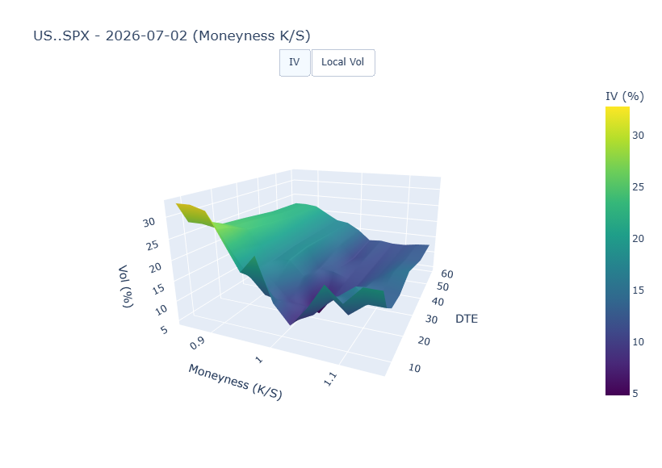
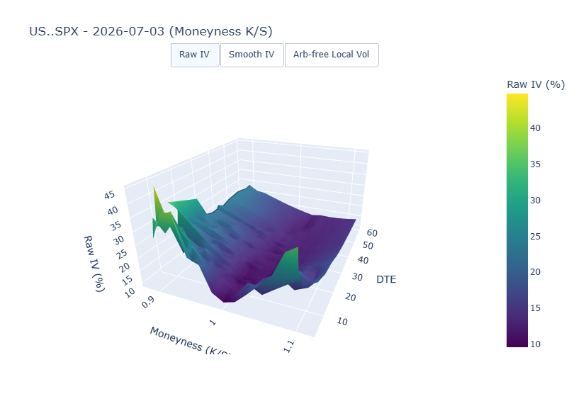
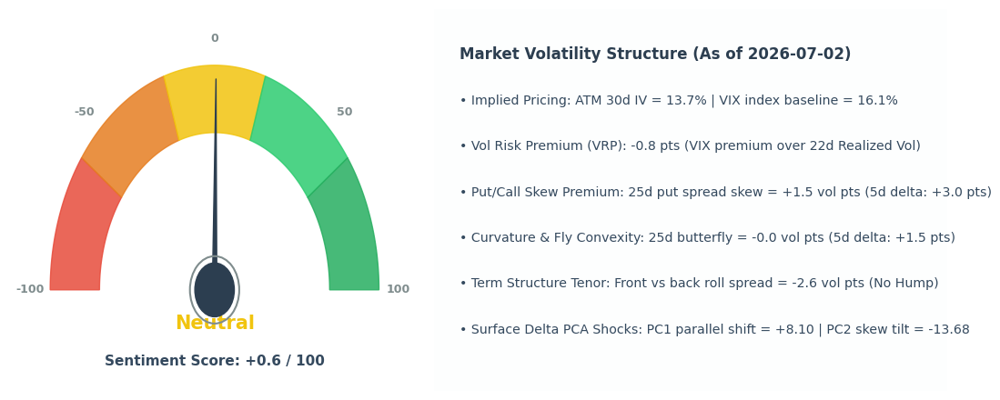

# Quantitative Volatility Research Studies / 波动率量化研究库

This research folder houses two major quantitative studies on US stock indices (SPX, DJI, NDX) focusing on volatility surface structure and macro volatility regime analysis.

本研究目录包含针对美股大盘指数（SPX、DJI、NDX）的两大波动率核心研究，分别解决“日内/跨期波动率曲面瞬时结构”与“中长期宏观波动率机制过滤”两大问题。

---

## Interactive Studies Overview / 研究概述

1. **Option Volatility Surface & PCA Delta Sentiment / 期权波动率曲面与 Delta 主成分分类情绪研究**:
   - **File / 对应文件:** [vol_surface_study.ipynb](vol_surface_study.ipynb)
   - **Core Focus / 核心要点:** Ingests options chain matrices, interpolates continuous Implied Volatility grids over Moneyness ($K/S$) and Tenor ($DTE$), applies Dupire's PDE solver for 3D Local Volatility mapping, and reduces option delta changes via PCA to build a real-time Compass Bull/Bear Speedometer.
   - 解析多维度期权链矩阵，在偏离度（Moneyness）与期限双维度网格上插值出隐含波动率曲面，利用 Dupire 局部波动率偏微分方程提取瞬时局部波动率网格。同时，对曲面每日德尔塔（Delta）特征变动进行 PCA 主成分降维，构建牛熊极值情绪时速指标。

2. **HMM Volatility Regime Transition Filters / 基于 HMM 的滚动 walk-forward 机制切换研究**:
   - **File / 对应文件:** [vol_regime_study.ipynb](vol_regime_study.ipynb)
   - **Core Focus / 核心要点:** Designs a daily walk-forward walk (rolling fit) Gaussian Hidden Markov Model (HMM) on the index's **lagged Volatility Risk Premium (`lagged_VRP`)**. Generates out-of-sample (OOS) state probabilities to identify low-volatility calm regimes and high-volatility turbulent regimes, backing it up with index trend-following long-only backtests.
   - 利用指数**滞后波动率风险溢价（`lagged_VRP`）**作为单一特征，通过滚动 2 年（504 交易日）的滑动窗口日频拟合高斯 HMM。求得日频样本外低波平静期与高波恐慌期的条件状态概率。回测表明，该状态过滤器在避开重大回撤和提高夏普比率方面极具成效。

---

## 1. Option Volatility Surface & Dupire Local Vol / 波动率曲面与 Dupire 局部波

Implied volatility (IV) extracted from options varies across strikes (skew/smile) and maturities (term structure). Continuous smoothing allows us to model a regular 3D surface. Under the risk-neutral measure, Dupire's formula relates the local volatility ($\sigma_{\text{local}}$) directly to the partial derivatives of European option prices, or equivalently, the implied volatility surface:

期权链提取出的隐含波动率随行权价（偏斜/微笑）和到期期限（期限结构）变动。通规则的双维插值可以拟合出完整的 3D 隐含波曲面。在风险中性测度下，Dupire 局部波动率（$\sigma_{\text{local}}$）求解器直接代入隐含波的一阶、二阶偏导，求解出瞬时标的资产处的局部风险水平：

$$\sigma_{\text{local}}^2(K, T) = \frac{\frac{\partial C}{\partial T} + r K \frac{\partial C}{\partial K}}{\frac{1}{2} K^2 \frac{\partial^2 C}{\partial K^2}}$$

In [vol_surface_study.ipynb](vol_surface_study.ipynb), are generated:
- **Bloomberg-Style 3D Volatility Mesh / 3D 隐含与局部波格点图**:
  
- **Moneyness-Based IV Contour Grid / 行权价偏离度（Moneyness）与期限隐含波连续热力图**:
  

From these structural matrices, we perform PCA via [../surface_sentiment.py](../surface_sentiment.py) to map deformations. Combining Level shifts (PC1) and Twist/Slope shifts (PC2) with basic indicators (skew, slope, VIX), we output the consolidated **Compass Sentiment Speedometer Gauge**:

通过对差值后的斜率差动态德尔塔（Delta）特征进行主成分降维（PCA），结合 PC1（水平移动）、PC2（扭曲移动）、ATM Skew、Term Slope 和 VIX 绝对水位，输入至集成时速算法，输出 **罗盘牛熊情绪时速表**：



---

## 2. HMM-based Volatility Regime Shading / 隐马模型机制过滤器

To implement the long-term trend filter analyzed in [vol_regime_study.ipynb](vol_regime_study.ipynb), we define:

为实现中长线防回撤的平滑过滤，我们在 [vol_regime_study.ipynb](vol_regime_study.ipynb) 中定义：

- **Realized Volatility ($RV_{22}$):** Annualized rolling 22-day standard deviation of index log returns.
- **Lagged Volatility Risk Premium ($lagged\_VRP$):** $IV_{t-22} - RV_{22, t}$.

- **已实现波动率（$RV_{22}$）:** 标的指数 22 交易日的滚动对数年化标准差。
- **滞后波动率风险溢价（$lagged\_VRP$）:** 22 天前的平价隐含波与当前已实现波动的差值：$IV_{t-22} - RV_{22, t}$。

A Two-State Gaussian HMM is fit on a rolling 504-day (2-year) windows ending at $t-1$. We evaluate today's OOS posterior state probability $P(\text{low today} \ge 0.5)$ and the future projection probability $P(\text{low tomorrow} \ge 0.5)$ to filter whipsaws:

在滚动 504 交易日的窗口上，以每日 $t-1$ 之前的数据拟合状态，提取今日样本外后验平静状态概率 $P(\text{low today})$ 与结合转移概率得出的明日预测概率 $P(\text{low tomorrow})$，当两者同时 $\ge 0.5$ 时发出多头信号：

```python
signal_today = int((prob_low_vol >= 0.5) and (prob_low_vol_tmr >= 0.5))
```

This successfully shades turbulent high-volatility crash regimes in red:

该分类器在历史回测中表现出其显著的避险与染色特征，红色区域代表识别出的高波震荡/危机时期：


Applying this regime filter in a diagnostic long-only trading backtest results in substantial outperformance, reducing max drawdown and significantly increasing cumulative returns:

将这一波动率机制信号代入只做多/平仓的诊断性策略，可取得超越大盘（S&P 500、道琼斯、纳斯达克 100）的稳健净值曲线：


---

## Module Code Integration / 核心脚本联动

- Use [vol_surface_study.ipynb](vol_surface_study.ipynb) to study options surface dynamics and run interactive plots. Reusable production methods are in [../vol_surface.py](../vol_surface.py) and [../surface_sentiment.py](../surface_sentiment.py).
- Use [vol_regime_study.ipynb](vol_regime_study.ipynb) for retro backtest evaluation of the walk-forward classification engine. Live production-grade rolling predictions are served by [../volatility_regime.py](../volatility_regime.py).
- Local Web monitoring visual interface is fully integrated inside [../app.py](../app.py).

- 使用 [vol_surface_study.ipynb](vol_surface_study.ipynb) 进行波动曲面、局部波方程插值和 PCA 情绪特征调试，封装模块位于 [../vol_surface.py](../vol_surface.py) 与 [../surface_sentiment.py](../surface_sentiment.py)。
- 使用 [vol_regime_study.ipynb](vol_regime_study.ipynb) 进行 HMM 滚动分类机制在各指数下的历史回测和多特征比对，封装模块位于 [../volatility_regime.py](../volatility_regime.py)。
- 本地 Web 交互与实时信号展现集中在根目录下的核心可视化程序 [../app.py](../app.py) 中。
